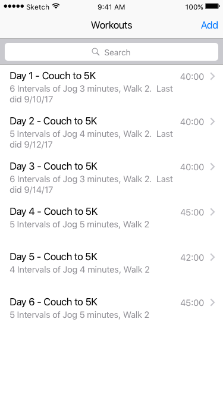
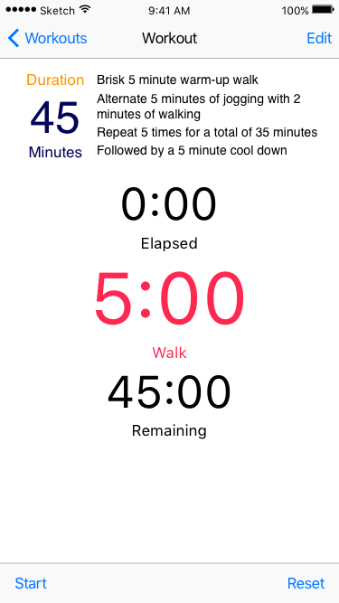

# Trainer
Guide you through an interval workout.

This application allows the user to define workouts with activities for varying time periods, and then tracks
the workout and gives notice to change activities.  For example:

1. Warmup walk for 5 minutes
2. Repeat 5 times:

  a. Jog 5 minutes

  b. Walk 2 minutes

3. Cooldown walk for 5 minutes

At each transition, the app will beep and vibrate.
